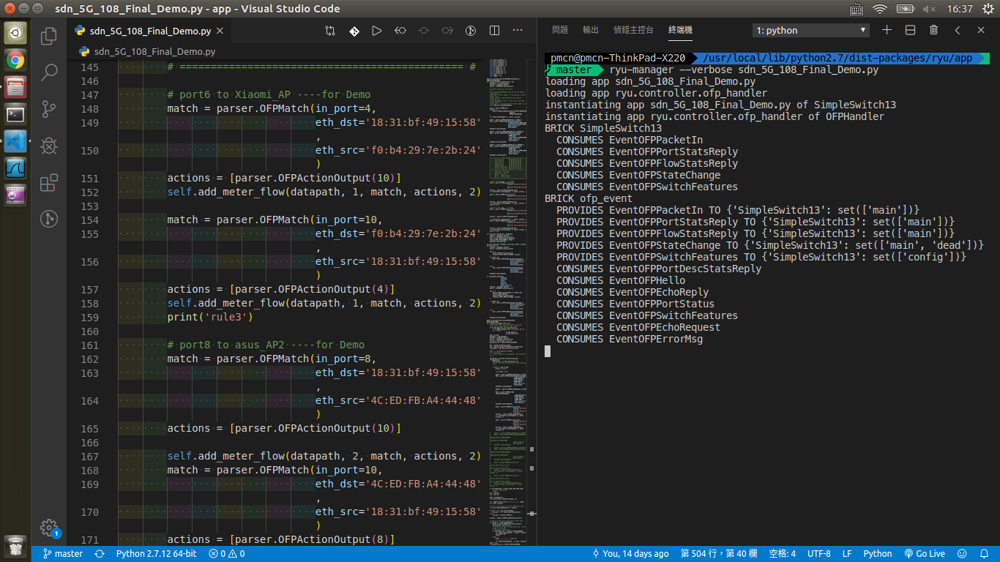
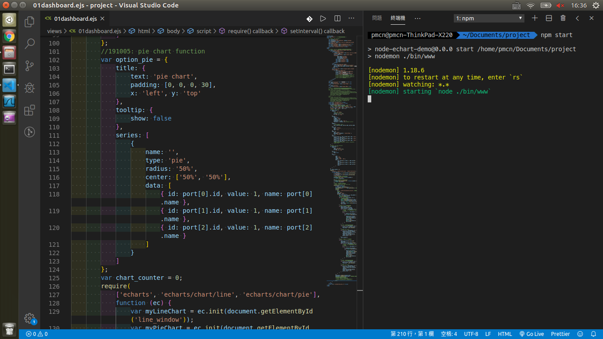

## SDN_Network Slicing

### Device:
* Switch：RT188T
* Controller：ThinkPad
* AP：ASUS RT-AC68U
* OpenFlow：OpenFlow 1.3

## Run File

Go to folder "/computer/usr/local/lib/python2.7/dist-packages/ryu" and open "app" folder with VSCode and start with in terminal
```bash
ryu-manager --verbose ryu.app.sdn_5G_107_Final_Project.py
```


>`sdn_5G_107_Final_Project.py` can change the `.py` file what you want to run

## Traffic Monitoring

Go to folder "computer/home/pmcn/Document" and open "project" with VSCode and start with in terminal
```bash
npm start
```

